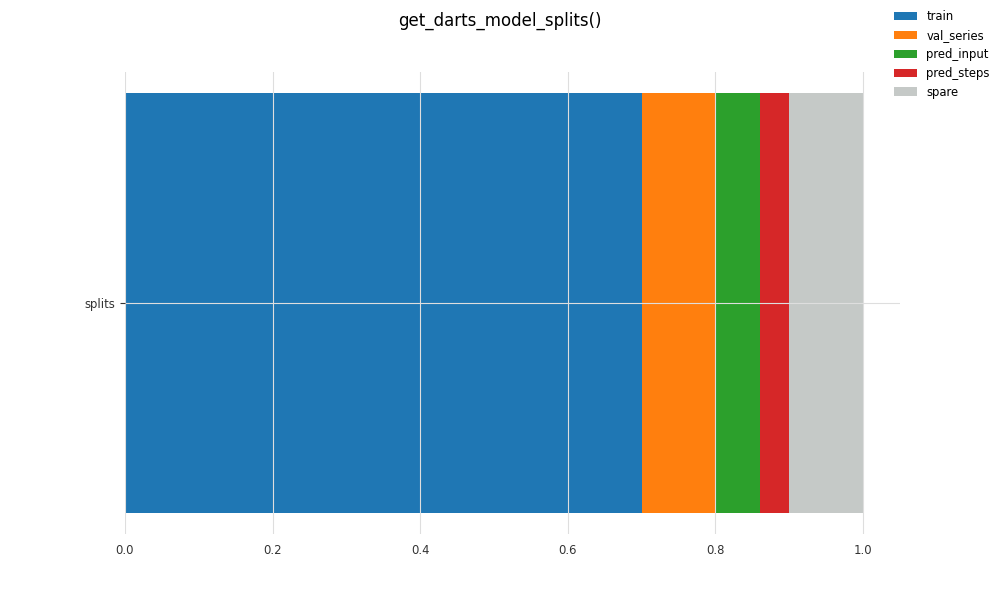

# Darts Time Series TFM Forecasting

A complete set of Python solutions for the optimization of Torch Forecasting Model (TFM) parameters for time series forecasting with Darts.
<p></p>

This article provides solutions to all of the pain points I experienced while working with Darts Torch Forecasting Models (TFM). The Darts terminology is explained, clarifying what univariate and multivariate series are, and the purpose and benefits of static, past, and future covariates. A model selection process is discussed that narrows down the wide choice of model options. A single synthetic data set that includes noisy multivariate series, and covariates is provided for testing models. A model splitting Python function and methodology that works with any Darts model is proposed. A solution for solving for the TFM model arguments input_chunk_length and output_chunk_length maximum values, and then optimization of those hyperparameters is provided. And then finally, tools for slicing past and future covariates to the required time span so that they work the first time when you train and run a prediction on a PyTorch (Lightning)-based model.

# Applications
Darts can be used for time series forecasting, anomaly detection, and filtering. Tools are also included for data processing tasks (split, scale, fill missing values, etc.) and metrics for evaluating forecast model performance. Use the links provided to explore what models or tools are available based on your application.

# Why Darts?
Darts is an open source Python library designed to make the use of machine learning on time series data easy. Using any of the models is easy because they all have standard .fit(), .predict(), .plot(), and other methods with arguments that are mostly common among the models. Default arguments for these modeling methods have been established that will get a beginner close to a good model quickly. Multiple time series can be consumed by many of the models, as well as the inclusion of related past, future, and static data. The Darts excellent online documentation provides details on the capabilities of each model, and many examples of their use with Darts data sets.

# Darts Terminology
Think of a Darts TimeSeries as a subset of a Pandas DataFrame or Series. A Pandas DataFrame can hold a wide variety of data types, categorical data, multiple indexes, etc. The Darts TimeSeries data structure has specific characteristics that makes it ideal for working with time series data. A univariate TimeSeries is similar to a Pandas Series in that it has one column (Darts calls this a component), and a linear monotonic increasing index. A multivariate TimeSeries is like a Pandas DataFrame with two or more columns of numeric data and a shared single index. A Darts TimeSeries index is either of Pandas data type datetime or range (numeric of type integer). My articles and code will refer to either a TimeSeries or series, but they are always the same thing. 

Many of Darts models also accept multiple series. These are passed to the modeling methods as a Python list with multiple univariate series. 

A series with one sample or row is deterministic, and a series with more than one row is stochastic or probabilistic. Probabilistic forecasting is similar to forecasting with confidence intervals, providing both point predictions and estimates of how far off those estimates might be.

The target series is the one you want to derive a forecast from, using its historical values. It is the series you assign to the model .predict() method argument 'series'. A covariate series has some relationship to the dependent variable (target series) of interest, but forecasting of this series is not of interest. 

Many of Darts model .fit() and .predict() methods optionally accept past covariates, future covariates, and static covariates. Past covariates always have an index that spans the model training / validation interval, plus some interval in the forecast interval.  Future covariates must have data for the training/validation interval, the forecast interval, and some interval past the forecast horizon. More details to follow. 

A static covariate is essentially time series metadata. They are most useful for improving model forecasts for multiple target time series. They must be embedded into the multiple target time series. Darts has functions to make this easy to implement, and your model result will typically benefit from them when employed.

# Selecting Forecast Models
Before you consider selecting a model for forecasting, make sure you have and include all of the data available as input to the model. It is tempting to start out simple and only include a single univariate time series. But omitting any of the relevant data can have a dramatic influence on a model's prediction performance. 
Begin by using the forecasting models table to identify the scope of models applicable to your data in terms of univariate / multivariate, multiple series, covariates, and if probabilistic forecasting and/or if sampled or 
distribution parameters are desired. 
A few things to note that are not in the forecasting models table, but are described in the documentation for each model:
- The TFTModel Torch Forecasting Model (TFM) requires future covariates.
- The output_chunk_length for the RNNModel TFM is set to a value of 1 internally, and although it will accept it specified as an argument, it will be ignored. Additionally, unlike other TFM's, it has the argument training_length. 
- Many of the Local Forecasting Models (LFM) require the seasonal period specified as a model argument. Fortunately, Darts has a function [name the function] that makes it easy to measure that value. 
- Those LFM's that don't require a seasonal period typically have a lags argument that should be specified and optimized. If covariates are employed, then you must specify an associated lag argument such as lags_past_covariates and/or lags_future_covariates.

# GitHub Repository
All of the code including the functions and the examples on using them in this series of articles is hosted on GitHub in the Python file medium_darts.py. This code was built on Python 3.11.2, Darts v0.26.0, Pandas 2.1.1, TensorFlow v2.15.0, and others. You can see how to install Darts by visiting this link.

To use a function from the medium_darts.py file, add the file to the same folder as where your Python file exists, and then in that Python file, include the function of interest. Example:
```      
from medium_darts import sine_gaussian_noise_covariate

df = sine_gaussian_noise_covariate(add_trend=False, include_covariate=True)
```

At the end of the Python file medium_darts.py are examples on how to:
- Create synthetic time series data using sine_gaussian_noise_covariate() and then plot the series using plt_darts_ts_stacked().
- Use function get_darts_model_splits() to split a series into train, val_series, test, pred_input, and get the pred_steps (n). 
- Optimization of input_chunk_length & output_chunk_length for all TFMs that support past, future, & static covariates and multivariate series. Each trained model is saved, and then the best result is plotted. 
- Using the trained TFM's to generate a forecast for new multivariate series. 

To find, train, and use trained Torch Forecasting Models, you can follow the two examples associated with the last two bullet points above. In the Python file medium_darts.py they are organized under functions named:
- train_tfm_that_support_past_future_static_covariates()
- test_all_past_future_static_covariate_trained_models_against_new_series()

You can easily adapt them to remove covariates, change the target series from multivariate to univariate, and adjust the scope of models trained. I picked the widest scope of complexity so that the examples demonstrated a nearly complete modeling process. 
What isn't covered by the library and the examples is modeling with multiple time series, and backtesting. Those topics are covered well by Darts documentation.

# Synthetic Data Set
Using examples from the Darts documentation and the Darts time series generation tools, I came up with a synthetic data set that works well for challenging most of the Darts models. The primary univariate signal has seasonality, and noise that gets worse as time progresses. It has options to return a multivariate noisy series with three components (columns), each with an optional trend, and a sinusoidal covariate. The length of the series is adjustable, but defaults to a minimum recommend length of 400 rows for model training. The index is of type datetime and the start of that date can be adjusted. You can easily convert the index to an integer.
<p></p>

The file 'medium_darts.py' on the GitHub repository contains the function sine_gaussian_noise_covariate() and examples on how to use it. That example also shows how to use plt_darts_ts_stacked() to quickly visualize the signals. 
All of the examples in this multi-part series of articles will use this synthetic series for the training of models because it provides data for demonstrating how to:
- Automatic optimization of input_chunk_length and output_chunk_length for multiple TFMs in one execution.
- Training models with a multivariate target series, static covariates, past covariate, and future covariate series.
- Forecasting a new series using a trained model.

# Split Options for Model Training
Before you split a series for modeling, you want to add any static covariates to the source series. The Darts documentation covers this pretty well, and it is also demonstrated in the examples from the medium_darts.py file. 

All of the Darts TFMs support the assignment of a validation series to the .fit() method via val_series, but most of the LFM's do not (the exceptions are: LightGBMModel,   XGBModel, and CatBoostModel). 

Another thing that influences model splitting is the use of future covariates. Future covariates for TFM's need a little extra time span past the end of the prediction time span. If you allocate all of the remaining time span for your source data to the series passed to .predict(), then an error will be raised. 

I created a splitting function and methodology that works for any Darts model, and addresses the two prior mentioned issues. It makes it easy to allocate a portions of the target series the series passed to the Darts .fit() and .predict() methods for any model. 

The function get_darts_model_splits() accepts a series ts, and then allocations specified as a percentages to divide up the series to train, val_series, and test. Series test is then allocated to pred_input (optional) and pred_steps, but the best practice is for that allocation not to add up to 100% so that some is left over for future covariates. Note that pred_steps or n when passed to .predict() is not a series, but the number of rows that will be the forecast / prediction interval. 

The series train, val_series, and test all follow each other sequentially according to the source series ts index. If val_series is not employed, then test follows train. The series pred_input is allocated from the beginning of series test when employed. When not using pred_input, pred_steps starts at the beginning of test.

<p></p>

For TFMs, you typically allocate most of the series 'ts' to train, and then smaller amounts to 'val_series', 'pred_input', and pred_steps. 

The function get_darts_model_splits() also optionally min/max scales each series to a range of 0.0 to +1.0, something that most TFM's either require, or fit better when employed. The function generates a nice table of the splits, showing the timespan associated with each. It works with both indexes of type datetime or integer, and it handles multivariate target series (but not multiple series passed as a list). 

As an example, if you wanted to allocate a series ts to the LFM AutoARIMA, you could define the splits as shown below. Note that val_series and pred_steps set to None, and the sum of train, val_series, and test is 1.0. Half (0.5) of what is allocated to the series test is allocated to pred_steps.  Note that pred_steps is an integer for the number of rows for the prediction, and it is returned as such, not as a series.
```
train, val, test, pred_input, pred_steps = get_darts_model_splits(ts=ts, train=0.8, val_series=None, test=0.2, pred_input=None, pred_steps=0.5, min_max_scale=False, plot=False)
```
Similarly, if you wanted to allocate a series ts to a TFM, then you would probably include values for both val_series and pred_input, and you would want the sum of pred_input and pred_steps to be less than 1.0 to allow for any future covariates. 

When the function option 'verbose=True' is enabled, it will output the details of the splits into a useful table as shown below. The table row 'future_covariates' tells you how much time span from series test is available for training models with future covariates.
```
df = sine_gaussian_noise_covariate(add_trend=False, include_covariate=True)

# Get a Darts univariate timeseries from the first column in df,
ts = TimeSeries.from_series(pd_series=df.iloc[:,0]) 

# Split the TimeSeries data into train, val, test, pred_input, pred_steps
train, val, test, pred_input, pred_steps = get_darts_model_splits(ts=ts, train=0.7, val_series=0.1, test=0.2, pred_input=0.3, pred_steps=0.2, min_max_scale=True, plot=False)

get_darts_model_splits()..
Darts univariate TimeSeries with 400 rows
Scaling data 0.0 to +1.0
              series|              index start|                index end|         length|          width
                  ts|      2000-01-01 00:00:00|      2001-02-03 00:00:00|            400|              1
               train|      2000-01-01 00:00:00|      2000-10-06 00:00:00|            280|              1
          val_series|      2000-10-07 00:00:00|      2000-11-15 00:00:00|             40|              1
                test|      2000-11-16 00:00:00|      2001-02-03 00:00:00|             80|              1
          pred_input|      2000-11-16 00:00:00|      2000-12-09 00:00:00|             24|              1
          pred_steps|      2000-12-10 00:00:00|      2000-12-25 00:00:00|             16|              1
   future covariates|      2000-12-26 00:00:00|      2001-02-03 00:00:00|             40|              1
```
You don't of course need to use get_darts_model_splits() to split a Darts series for modeling. Darts provides many excellent tools for splitting series, and the code within the function get_darts_model_splits() is a great way to explore how to use some of those methods. 
# Next Steps
Once your source series is split, you want to get to the point where you can initialize a model, train it with the model.fit() method, and then run a prediction with model.predict(). But in order to do that, you need to specify an optimized input_chunk_length and output_chunk_length for a TFM, and then use those values to be sure the past and future covariate series have  the required time spans.  

The maximum value for input_chunk_length and output_chunk_length varies by model, and is also influenced by how you split your series, what inputs will be used for .fit() and .predict(), and the length of pred_steps (n). Additionally, the sum of these values needs to be below a limit as well. I found it challenging to estimate these limits for each TFM, so I created a helper function named get_darts_tfm_arguments(). Simply pass a Darts model name and the model splits returned by get_darts_model_splits(), and the function will return the values:
- input_chunk_length_max
- output_chunk_length_max
- sum_chunk_length_limit
- training_length_max (for RNNModel only)

# Optimizing TFM Model Arguments
Using get_darts_tfm_arguments(), the maximum values for input_chunk_length, output_chunk_length, and the sum of those values is known. The next step is to optimize them for each TFM you want to run against your data set. The Darts .gridsearch() method doesn't help here, because of the close interaction between those three specified limits. And despite the examples provided by Darts, I haven't been able to figure out how to use Optuna for hyperparameter optimization. So I wrote my own function get_darts_tfm_arguments_optimized() to achieve this task. It isn't fast, nor is it sexy, but it gets the job done. 

The coarse optimization increments the values for input_chunk_length and output_chunk_length in increments of powers of 2 (²⁰=1, ²¹=2, ²²=4, ²³=8, …) and then tries all combinations that respect the model specific requirements. After the coarse optimization is complete, then a fine optimization is optionally (highly recommended) performed, and the best set of values are eventually returned.

As demonstrated in the example within the medium_darts.py file, after optimizing input_chunk_length, output_chunk_length with get_darts_tfm_arguments_optimized(), the trained model is saved to a local file. Saving the file is highly recommended, especially since it will take a considerable amount of time to optimize the two model arguments. Once you do, when you retrieve it later, you have access to everything you need to use that trained model to run a prediction on the same, or a (newer) series. 

# Slicing Covariates for Model Training
With optimized input_chunk_length and output_chunk_length values in hand, you are now ready to prepare the past and future covariates for model training and prediction. The function slice_tfm_covariates_for_model_training() makes this easy by slicing them to the minimum time span required, and optionally min/max scaling them. It not only prepares past_covariates and future_covariates, but also val_past_covariates and val_future_covariates needed when val_series is passed to model.fit(). 

# Fit & Predict
The hard work is now done. As demonstrated by the examples provided in the medium_darts.py file, it is a simple matter to initialize a model with the optimized input_chunk_length and output_chunk_length arguments, and pass the other inputs to the model .fit() and .predict() method. Plotting the results is made easy by the use of plt_model_training() to see all of the inputs to the model and the result.
<p>

# Forecasts Using a Trained Model
The example in the medium_darts.py bundled under the function test_all_past_future_static_covariate_trained_models_against_new_series() demonstrates how to read a saved trained model and then run a prediction using another series. Series splitting is much more simple since only one target series needs to be passed to the model.predict() method. How to do that series splitting can be found in the Darts TimeSeries functions page, and by reviewing the example I provided. The slicing of past and future covariates is slightly different for only the model.predict() method, so I created the function slice_tfm_covariates_for_trained_model() to make that easy. And finally, the function plt_model_trained() makes it easy to visualize the results of that prediction.

<p></p>

# Conclusions
The Darts library does an incredible job of simplifying the use of a wide variety of machine learning models for time series forecasting. The Python functions and examples presented in this article attempt to fill in some of the holes in the documentation, leading to a complete path for running Torch Forecasting Models against a multivariate data set with past, future, and static covariates. I truly hope this helps other Darts users. Please don't hesitate to contact me and let me know if this article helped you. 

# References
All images created by the author.

GitHub repository with functions and examples all contained within the single medium_darts.py Python file. 

[Darts table for forecasting model selection](https://github.com/unit8co/darts?tab=readme-ov-file#forecasting-models)
